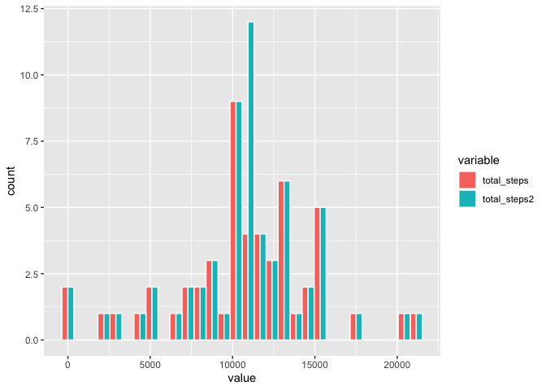

## 1. Loading and preprocessing the data

I will use `unzip()` and `read.csv()` to access the file, and `dplyr::as_tibble()` to format it.


```r
library(dplyr)
unzip("activity.zip")
temp <- read.csv("activity.csv")
activity <- as_tibble(temp)
```

---

## 2. What is mean total number of steps taken per day?

### 2.1. Calculate total steps per day.

I will use "dplyr" for this first task.


```r
library(ggplot2)
daily_steps <- activity %>%
        group_by(date) %>%
        summarise(total_steps = sum(steps))
daily_steps
```

```
## # A tibble: 61 × 2
##    date       total_steps
##    <chr>            <int>
##  1 2012-10-01          NA
##  2 2012-10-02         126
##  3 2012-10-03       11352
##  4 2012-10-04       12116
##  5 2012-10-05       13294
##  6 2012-10-06       15420
##  7 2012-10-07       11015
##  8 2012-10-08          NA
##  9 2012-10-09       12811
## 10 2012-10-10        9900
## # … with 51 more rows
```

### 2.2. Make a histogram.

I will use "ggplot2" to plot a histogram (remembering that histogram is a frequency plot with a continuous variable - in this case, total steps - organised into bins).


```r
ggplot(daily_steps) +
        geom_histogram(mapping = aes(x = total_steps), binwidth = 500)
```

```
## Warning: Removed 8 rows containing non-finite values (stat_bin).
```

<!-- -->

### 2.3. Calculate and report the mean and median steps per day.

With the `daily_steps` tibble I can calculate mean and median values:


```r
summarise(daily_steps, mean_steps = mean(total_steps, na.rm = TRUE), median_steps = median(total_steps, na.rm = TRUE))
```

```
## # A tibble: 1 × 2
##   mean_steps median_steps
##        <dbl>        <int>
## 1     10766.        10765
```

---

## 3. What is the average daily activity pattern?

### 3.1. Time series plot

Find the mean number of steps per time interval using "dplyr", then graph it with "ggplot2".


```r
by_interval <- activity %>%
        group_by(interval) %>%
        summarise(mean_steps = mean(steps, na.rm = TRUE))
ggplot(by_interval) +
        geom_line(mapping = aes(x = interval, y = mean_steps))
```

<!-- -->

### 3.2. Which 5 minute interval contains the maximum number of steps, on average?

I can subset out the portion of the `by_interval` table containing this.


```r
by_interval[which(by_interval$mean_steps == max(by_interval$mean_steps)),]
```

```
## # A tibble: 1 × 2
##   interval mean_steps
##      <int>      <dbl>
## 1      835       206.
```
The answer is therefore 835. 

---

## 4. Imputing missing values

### 4.1. Calculate and report total number of missing values.

I can use the `complete.cases()` function: the inverse will give us the total number of rows containing an `NA`.


```r
sum(!complete.cases(activity))
```

```
## [1] 2304
```
### 4.2. Devising a strategy for all the missing step values.

<<<<<<< HEAD
I have chosen to use mean values for each interval, given these have been previously calculated and exist in the `by_interval' tibble. 
=======
I have chosen to use mean values for each interval, given these have been previously calculated and exist in the `by_interval` tibble. 
>>>>>>> dffa94b (Ready for assessment.)


```r
by_interval
```

```
## # A tibble: 288 × 2
##    interval mean_steps
##       <int>      <dbl>
##  1        0     1.72  
##  2        5     0.340 
##  3       10     0.132 
##  4       15     0.151 
##  5       20     0.0755
##  6       25     2.09  
##  7       30     0.528 
##  8       35     0.868 
##  9       40     0     
## 10       45     1.47  
## # … with 278 more rows
```

### 4.3. Creating a new dataset with the missing data filled in.

The following code:
<<<<<<< HEAD

1. Creates a copy of the original data frame, called `activity2`.
2. Converts the data in the "steps" column to numeric.
3. Uses a `for` loop to run through each row of the `activity2` data frame.
4. Uses an `if` argument to identify all the NAs.
    * If an NA is found, this value is then replaced with the mean value for the corresponding interval, as obtained from the `by_interval` tibble.


```r
activity2 <- as_tibble(temp)
activity2$steps <- as.numeric(activity2$steps)
for(i in 1:nrow(activity2)) {
        if(is.na(activity2[i, "steps"])) {
                activity2[i, "steps"] <- as.numeric(by_interval[which(by_interval$interval == as.integer(activity2[i, "interval"])),2])
        } 
}
activity2
```

```
## # A tibble: 17,568 × 3
##     steps date       interval
##     <dbl> <chr>         <int>
##  1 1.72   2012-10-01        0
##  2 0.340  2012-10-01        5
##  3 0.132  2012-10-01       10
##  4 0.151  2012-10-01       15
##  5 0.0755 2012-10-01       20
##  6 2.09   2012-10-01       25
##  7 0.528  2012-10-01       30
##  8 0.868  2012-10-01       35
##  9 0      2012-10-01       40
## 10 1.47   2012-10-01       45
## # … with 17,558 more rows
```

### 4.4. Making a histogram of total steps, and reporting mean and median steps for each data set.

Firstly, create a table showing the total steps for the `activity2` data set.


```r
daily_steps2 <- activity2 %>%
        group_by(date) %>%
        summarise(total_steps2 = sum(steps))
daily_steps2
```

```
## # A tibble: 61 × 2
##    date       total_steps2
##    <chr>             <dbl>
##  1 2012-10-01       10766.
##  2 2012-10-02         126 
##  3 2012-10-03       11352 
##  4 2012-10-04       12116 
##  5 2012-10-05       13294 
##  6 2012-10-06       15420 
##  7 2012-10-07       11015 
##  8 2012-10-08       10766.
##  9 2012-10-09       12811 
## 10 2012-10-10        9900 
## # … with 51 more rows
```

Merge the `daily_steps` and `daily_steps2` tables together, and keep the merged data frame as a tibble.


```r
both_daily_steps <- as_tibble(merge(daily_steps, daily_steps2))
```

Then plot two histograms comparing 
=======

1. Creates a copy of the original data frame, called `activity2`.
2. Converts the data in the "steps" column to numeric.
3. Uses a `for` loop to run through each row of the `activity2` data frame.
4. Uses an `if` argument to identify all the NAs.
    * If an NA is found, this value is then replaced with the mean value for the corresponding interval, as obtained from the `by_interval` tibble.


```r
activity2 <- as_tibble(temp)
activity2$steps <- as.numeric(activity2$steps)
for(i in 1:nrow(activity2)) {
        if(is.na(activity2[i, "steps"])) {
                activity2[i, "steps"] <- as.numeric(by_interval[which(by_interval$interval == as.integer(activity2[i, "interval"])),2])
        } 
}
activity2
```

```
## # A tibble: 17,568 × 3
##     steps date       interval
##     <dbl> <chr>         <int>
##  1 1.72   2012-10-01        0
##  2 0.340  2012-10-01        5
##  3 0.132  2012-10-01       10
##  4 0.151  2012-10-01       15
##  5 0.0755 2012-10-01       20
##  6 2.09   2012-10-01       25
##  7 0.528  2012-10-01       30
##  8 0.868  2012-10-01       35
##  9 0      2012-10-01       40
## 10 1.47   2012-10-01       45
## # … with 17,558 more rows
```

### 4.4. Making a histogram of total steps, and reporting mean and median steps for each data set.

Firstly, create a table showing the total steps for the `activity2` data set.


```r
daily_steps2 <- activity2 %>%
        group_by(date) %>%
        summarise(total_steps2 = sum(steps))
daily_steps2
```

```
## # A tibble: 61 × 2
##    date       total_steps2
##    <chr>             <dbl>
##  1 2012-10-01       10766.
##  2 2012-10-02         126 
##  3 2012-10-03       11352 
##  4 2012-10-04       12116 
##  5 2012-10-05       13294 
##  6 2012-10-06       15420 
##  7 2012-10-07       11015 
##  8 2012-10-08       10766.
##  9 2012-10-09       12811 
## 10 2012-10-10        9900 
## # … with 51 more rows
```

Merge the `daily_steps` and `daily_steps2` tables together, and keep the merged data frame as a tibble.


```r
both_daily_steps <- merge(daily_steps, daily_steps2)
```

Then plot two histograms comparing the two days. I will need to `melt` the table first, using the "reshape2" package. I'll then use "ggplot2" to plot the histograms.


```r
library(reshape2)
all_steps <- melt(both_daily_steps, id = "date", measured = c("total_steps", "total_steps_2"))
ggplot(all_steps) +
        geom_histogram(mapping = aes(x = value, fill = variable), colour = "white", position = "dodge")
```

```
## `stat_bin()` using `bins = 30`. Pick better value with `binwidth`.
```

```
## Warning: Removed 8 rows containing non-finite values (stat_bin).
```

<!-- -->

Finally, using the `all_steps` data frame (and converting it to a tibble), we can summarise and find the mean and median for each data set.


```r
as_tibble(all_steps) %>%
        group_by(variable) %>%
        summarise(mean = mean(value, na.rm = TRUE), median = median(value, na.rm = TRUE))
```

```
## # A tibble: 2 × 3
##   variable       mean median
##   <fct>         <dbl>  <dbl>
## 1 total_steps  10766. 10765 
## 2 total_steps2 10766. 10766.
```

As the above tibble shows, mean values are the same with our imputation method, while the median value is only very slightly increased.

## 5. Are there differences in activity patterns between weekdays and weekends?

Using the `activity2` data set, I will:

1. Convert the "date" variables to the `date` class.
2. Use `dplyr::mutate` to add in a "day_of_week" column, dependent on the `weekdays` function.
3. Use the `dplyr::if_else` argument to allow me to create the categorical variable "day_type" (weekend or weekdays).
4. `group_by` the dataset by both "interval" and "day_type" and `summarise` the data accordingly.
5. Plot the panel graph using ggplot
>>>>>>> dffa94b (Ready for assessment.)


```r
activity2$date <- as.Date(activity2$date)
by_interval2 <- activity2 %>%
        mutate("day_of_week" = weekdays(activity2$date),
               day_type = as.factor(if_else(day_of_week == "Saturday" | day_of_week == "Sunday", "weekend", "weekday"))) %>%
        group_by(day_type, interval) %>%
        summarise(mean_steps = mean(steps))
```

```
## `summarise()` has grouped output by 'day_type'. You can override using the
## `.groups` argument.
```

```r
ggplot(by_interval2) +
        geom_line(mapping = aes(x = interval, y = mean_steps, col = day_type)) +
        facet_grid(day_type~.)
```

<!-- -->
